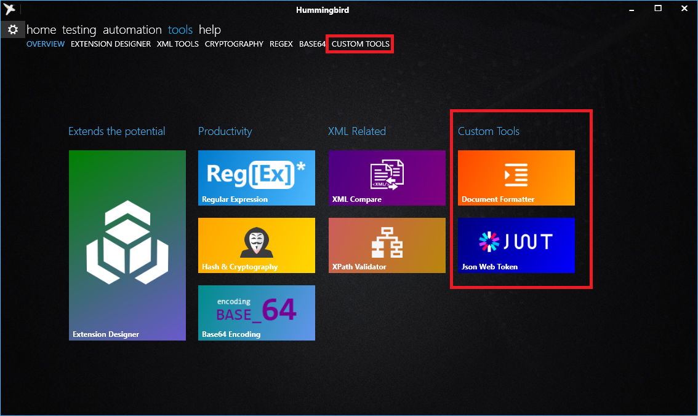

# hummingbird.customtools
An OpenSource extension aimed to add common and useful tools to Project Codename: Hummingbird
http://www.hummingbird-alm.com

While in this repository we maintain some highly used tools and can be considered as an example to make extension on Custom Tool.

### The following are the custom tools will be and currently under development
* Json Web Token: helps to work with Json Web Token (JWT), usually used in rest web services and oAuth authentication
* Document Formatter: A tool that can format XML and JSON document in pretty-print 

### The project contains a Test project that you can use the these tools independently 

## Install extension to Hummingbird Application.
The project will generate a ZIP package. To install the extension package, Goto Settings -> Extension Management
then choose (or drag-and-drop the zip package) to install.
Brief documentation: https://huaxing-yuan.github.io/hummingbird.doc/html/fb6150ac-4773-4457-afc2-e203cf917dc8.htm

### Hummingbird integrates some useful tools for people doing development and testing.
Following tools are natively built-in:
* Extension designer
* Regular Expression
* XML Compare (Ported from an old project)
* Hash and cryptography
* xPath Validator
* Base64 encoding

